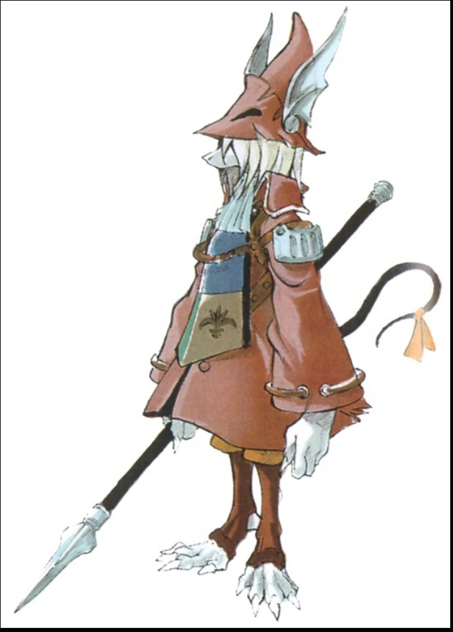

# Welcome to thebroodlebot commands documentation

## Command Categories {#comcat}
* [Broodlebot commands](#broobot)
* [Broodlebit commands](#broobit)
* [FF9bot commands](#ff9bot)
* [Other bot commands](#otherbot)

### List of broodlebot commands {#broobot}

* [!bot](#bot) or [!doc](#bot) or [!man](#bot) or[!help](#bot) 
* [!discord](#discord)
* [!lurk](#lurk)
* [!multi](#multi)
* [!pb](#pb)
* [!rules](#rules)
* [!so](#shoutout)
* [!social](#social)
* [lucky seven](#lucky)
* [meteor](#meteor)
* [rng](#rng)

Return to [Command Categories](#comcat)

---

### List of broodlebit commands {#broobit}
* [!broodlebits](#bits) or [!score](#bits) or [!bits](#bits)
* [!gamble](#gamble)
* [!give](#give)
* [!heist](#heist)
* [!hunt](#hunt)
* [!leaderboard](#top) or [!top](#top)
* [!steal](#steal)

Return to [Command Categories](#comcat)

---

### List of FF9bot commands {#ff9bot}
* [!list](#list)

* !abilities
  * !exclusive
  * !magical
  * !physical
  * !support
  * !universal
* !armor
  * !addons
  * !armlets
  * !gloves
  * !hats
  * !heavy armor
  * !helmets
  * !jewels
  * !light armor
  * !robes
* !weapons
  * !claws
  * !daggers
  * !flutes
  * !forks
  * !knight swords
  * !rackets
  * !rods
  * !spears
  * !staves
  * !swords
  * !thief swords
  * !unequippable
  
Return to [Command Categories](#comcat)

---

### List of other bot commands {#otherbot}
There will just be a simple text reply when you type these commands. We don't want to ruin the fun so no more documentation is provided here. Just try the commands in chat and see what happens. 

* !beautiful
* !boobs
* !catjam
* !ff9bot
* !funk
* !glod
* !gold
* !lani
* !patch
* !rainbowjam
* !ripandtear
* !shutthefunkup
* !steinaa
* !timeout steth
* !waa
* !whyisthecameraoff
* !whyreset
* beep
* literally ff9
* luna
* reset
* rip
* toransu
* trance

Return to [Command Categories](#comcat)

---

## Detailed documentation of commands
Here we will provide detailed description on how to use the commands and what they do.

### Broodlebot commands
#### Bot documentation manual {#bot}
```
!bot
!doc
!man
!help
```
* will return link to this bot documentation manual

Return to [Broodlebot commands](#broobot)

---

#### Discord link {#discord}
```
!discord
```
* will return invite link to broodles discord

Return to [Broodlebot commands](#broobot)

---

#### Lurk {#lurk}
```
!lurk 
```
* will notify chatroom that you are going to lurk

Return to [Broodlebot commands](#broobot)

---

#### Multi {#multi}
```
!multi 
```
* will return a link to multiple twitch streams in parallel
* usually these are also ff9 runners and good friends of broodles

Return to [Broodlebot commands](#broobot)

---

#### PB {#pb}
```
!pb
```
* will display current personal best ff9 time of thebroodles

Return to [Broodlebot commands](#broobot)

---

#### Rules {#rules}
```
!rules
```
* will return a link to the rules for drunkguise 

Return to [Broodlebot commands](#broobot)

---

#### Shoutout {#shoutout}

``` 
!so <channel name> 
```
* will provide a link to the kind persons twitch channel 
* do not fuck up spelling the channel name, tab completion is your friend

Return to [Broodlebot commands](#broobot)

---

#### Social {#social}
```
!social 
```
* will return broodles discord, twitter and youtube links

Return to [Broodlebot commands](#broobot)

---

#### Lucky seven {#lucky}
```
lucky seven
```
* will display a random valid lucky seven value
* string can be anywgere within message to trigger the command

Return to [Broodlebot commands](#broobot)

---

#### Meteor {#meteor}
```
meteor 
```
* will display a random valid meteor values
* string can be anywgere within message to trigger the command

Return to [Broodlebot commands](#broobot)

---

#### RNG {#rng}
```
rng 
```
* will display a random number ranging form 1 to 9999
* string can be anywgere within message to trigger the command

Return to [Broodlebot commands](#broobot)

---

### Broodlebit commands 
#### Broodlebits {#bits}
```
!broodlebits
!score
!bits
```
* will display the value of yout broodlebits

Return to [Broodlebit commands](#broobit)

---

#### Gamble {#gamble}
```
!gamble <value>
!gamble all
```
* value got to be positive and an integer 
* you can gamble all your brooglebits if you have the balls
* it's always a 50/50 for win or lose

Return to [Broodlebit commands](#broobit)

---

#### Give {#give}
```
!give <username> <value>
```
* username is not case sensitive 
* value got to be positive and an integer 

Return to [Broodlebit commands](#broobit)

---

#### Heist {#heist}
```
!heist
```
* use this command to start or join a heist
* there is no limit on how many people can join the hunt
* you can not join a heist when you are in jail
* heist payout is always 10k as long as you are successfull
* heist cooldown is 90 seconds

Return to [Broodlebit commands](#broobit)

---

#### Hunt {#hunt}
```
!hunt
```
* use this command to join the hunt
* at least 3 users neet to join to start a hunt
* the more people join the hunt the higher the payout will be
* there is no limit on how many people can join the hunt
* a hunt will start every 15 to 20 minutes

Return to [Broodlebit commands](#broobit)

---

#### Leaderboard {#top}
```
!leaderboard
!top
```
* will display the top 5 broodlebit owners

Return to [Broodlebit commands](#broobit)

---

#### Steal {#steal}
```
!steal <username> <value>
```
* username is not case sensitive 
* value got to be positive and an integer 
* you can only steal as much broodlebits as you got
* steal got a 40% success rate
* a successfull steal will steal all of the targeted value
* an unsuccessfull will put you in jail and you lose a random fraction of 6 of the targeted value 

Return to [Broodlebit commands](#broobit)

---

### FF9bot commands
#### List {#list}
```
!list 
```
* this bot got a build in documentation 
* just run the command and pick your subcategory from the list
* repeat until you reach the desired item description

Return to [FF9bot commands](#ff9bot)

---


"Despair. To be forgotten is worse than death."
